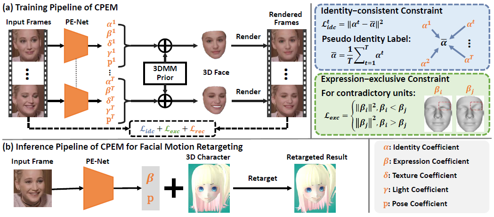

# CPEM: Consistent Parameter Estimation Model

This repository contains the code and supplementary material for our AAAI paper:  "Towards Accurate Facial Motion Retargeting with Identity-consistent and Expression-exclusive Constraints".

<!-- 
<b>The Framework of CPEM</b>
 -->

||
|:--:|
|*A demo showing facial motion retargeting results of our CPEM*|

## Paper
[Towards Accurate Facial Motion Retargeting with Identity-consistent and Expression-exclusive Constraints](./assets/paper.pdf) \
 [[Supplementary material](./assets/supplementary.pdf)] \
Langyuan Mo, Haokun Li, Chaoyang Zou, Yubing Zhang, Ming Yang, Yihong Yang, Mingkui Tan \
Proceedings of the AAAI Conference on Artificial Intelligence(AAAI), 2022

## Dependencies

* pytorch>=1.7.0
* [pytorch3d](https://github.com/facebookresearch/pytorch3d)
* [face_alignment](https://github.com/1adrianb/face-alignment)
* [facenet_pytorch](https://github.com/timesler/facenet-pytorch)
* opencv-python
* numpy
* pyyaml
* scipy

## Getting Started

### Installation

1. Clone this repo:

        git clone https://github.com/deepmo24/CPEM.git
        cd CPEM/

2. install the dependencies above.

3. install face detector *FaceBoxes*:

        cd FaceBoxes/
        sh ./build_cpu_nms.sh
        pip install onnxruntime # if use onnxruntime to speed up inference

### Model

1. 3DMM model + pretrained model

    * We use the BFM09 model processed by [Deep3DFaceReconstruction](https://github.com/microsoft/Deep3DFaceReconstruction) for face identity and texture model, while the expression model is obtained by using deformation transfor technology to transfer the expression blendshapes from FaceWarehouse to BFM09.

    * Download link: [Dropbox](https://www.dropbox.com/sh/7jev5i61g17hiqw/AABSXqRjptk-HrGX2KlhejoHa?dl=0) or [BaiduNetdisk](https://pan.baidu.com/s/1gI3KYEdKV_47PqACn8ok3A)(extraction code: 7i7u)

    * Put the 3DMM model in `./data/BFM` directory

    * Put the pretrained model in `./data/pretrained_model` directory
    

### Testing

* Run general demo:

        python test.py --mode demo \
            --checkpoint_path ./data/pretrained_model/resnet50-id-exp-300000.ckpt \
            --image_path <path-to-image> --save_path <path-to-save>

* Run facial motion retargeting:
    
        CUDA_VISIBLE_DEVICES=1 python test.py --mode retarget \
        --checkpoint_path ./data/pretrained_model/resnet50-id-exp-300000.ckpt \
        --source_coeff_path <path-to-coefficient> --target_image_path <path-to-image> \
        --save_path <path-to-save>

* Render 3D face shape on the input image:

    * install rendering library *Sim3DR*:

            cd Sim3DR/
            sh ./build_sim3dr.sh

    * Rendering shape on the image plane:

            python test.py --mode render_shape \
                --checkpoint_path ./data/pretrained_model/resnet50-id-exp-300000.ckpt \
                --image_path <path-to-image> --save_path <path-to-save>

### Training

#### 1. Data preparation

We train our model with three datasets [VoxCeleb2](https://www.robots.ox.ac.uk/~vgg/data/voxceleb/vox2.html), [Feafa](https://www.iiplab.net/feafa+/)(need to apply) and [300W-LP](http://www.cbsr.ia.ac.cn/users/xiangyuzhu/projects/3DDFA/main.htm). 

1. Download the above datasets.

2. Construct the dataset like below:

        <train dataset>
        ├── data
        │   └── <person_id>/<video_clips>/<images>
        ├── face_mask
        │   └── <person_id>/<video_clips>/<images>
        ├── landmarks
        │   └── <person_id>/<video_clips>/<landmarks>
        ├── landmarks2d
        │   └── <person_id>/<video_clips>/<landmarks>
        └── front_face_flag.csv

    * `data` folder contains the raw images.
    * `face_mask` folder contains the face skin masks w.r.t. images, which can be genereted using [face-parsing.PyTorch](https://github.com/zllrunning/face-parsing.PyTorch).
    * `landmarks` folder contains the 3D facical landmarks w.r.t. images, which can be generated using [face_alignment](https://github.com/1adrianb/face-alignment).
    * `landmarks2d` folder contains the 2D facical landmarks w.r.t. images, which can be generated using [dlib](https://github.com/davisking/dlib).
    * `front_face_flag.csv` file saves the front face flag, which can be generated using `preprocess/cal_yaw_angle.py`.

3. We supply a demo dataset in `./data/demo_dataset` to help preprare your own datasets.

#### 2. Training the model

* (Try) training the model using demo dataset:

        python train.py --result_root results/cpem_demo \
            --voxceleb2_root data/demo_dataset/voxceleb2 \
            --lp_300w_root data/demo_dataset/300w_lp

* training the model using full dataset:

        python train.py --result_root results/<experiment-name> \
            --voxceleb2_root <path-to-voxceleb2> \
            --feafa_root <path-to-feafa> \
            --lp_300w_root <path-to-300w_lp>

## Citation

If this work is useful for your research, please star our repo and cite our paper.

    TODO